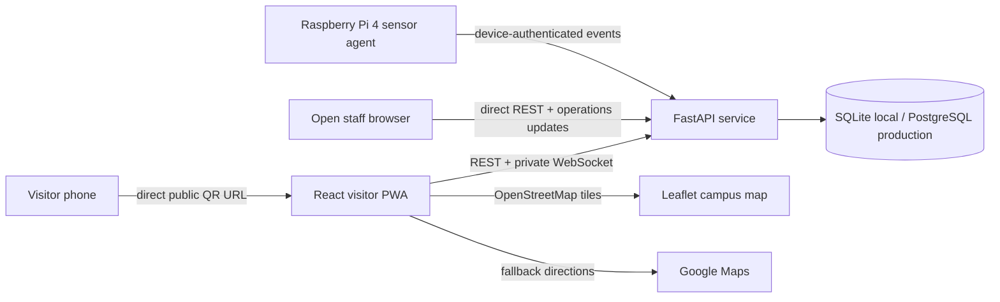

# SmartPark architecture

## System boundary

## Source of truth

The API owns current parking state. The React demo state is used only when `VITE_API_URL` is not configured. In API mode, the visitor fetches authoritative state after session creation, WebSocket messages, and reconnects.

Parking states are represented in the UI as:

| Backend state | Driver display | Meaning |
|---|---|---|
| `AVAILABLE` | Neutral gray/white | Bay can be allocated |
| `RESERVED` | Green assignment | Reserved for the current visitor when private |
| `OCCUPIED` | Solid red | Occupancy was confirmed |
| `OUT_OF_SERVICE` | Warning/neutral | Reserved for future sensor/config support |

Allocation is lowest-numbered available bay first. SQLite uses a process lock for the single-process prototype. PostgreSQL production should use row-level transactions and a distributed event bus for multiple workers.

## Privacy boundaries

Visitor sessions are passwordless: an opaque token, stored only as a hash in the backend, scopes one browser's assignment, timer, and billing. The current QR is a direct public URL and contains no signed checkpoint credential. Staff access is open by default. Raspberry Pi device events still require the device token; device liveness alone does not assert bay sensor health, which is reported per sensor.

The entrance sensor is an approach signal. It cannot identify a visitor or determine which bay is occupied. Security matching or per-bay sensors are required before changing a reservation to occupied.

## Frontend surfaces

- Visitor welcome: facility name/logo, live space states, public pricing, entrance checkpoint session, opt-in PWA install prompt.
- GPS card: Leaflet/OpenStreetMap, opt-in foreground geolocation, OSRM-compatible routed path with distance/ETA, and Google Maps fallback. Smart Park does not store visitor coordinates; the opted-in routing provider receives the current and destination coordinates.
- Parking schematic: two instrumented bays, L1 and L2, with sensor health, available, assigned, and occupied states.
- Assignment state: staff or a passwordless visitor can reserve only a recently confirmed free bay; physical occupancy overrides assignment.
- `/admin` opens directly without a staff login in the default configuration.
- Staff dashboard: live bays, settings, activity, payments, simulator, and direct QR entry URL.
- Visitor interface: public availability, opt-in GPS directions, assigned bay, backend timer, and manual payment/exit guidance.

## Runtime modes

### Demo mode

No `VITE_API_URL`. State is held in React and resets with a full page reload. This mode is useful for UI demonstrations only.

### API mode

Set `VITE_API_URL`. Visitor sessions, destinations, sensor state, assignments, billing, and private visitor events come from FastAPI. The frontend does not fabricate assignments after a successful backend response.

### Hardware mode

On a Raspberry Pi deployment, FastAPI serves the built React app, SQLite, and authenticated device API from one origin. The Pi agent reads entrance and L1/L2 sequentially, sends debounced idempotent events through a durable outbox, reports sensor health, and controls the assigned GPIO indicators and conservatively configured servo state machine. The backend ignores duplicate events, remains authoritative for assignments/timers/billing, and exposes current bay state to the visitor and open staff interfaces. Physical GPIO and servo behavior must be tested on the target Pi.
