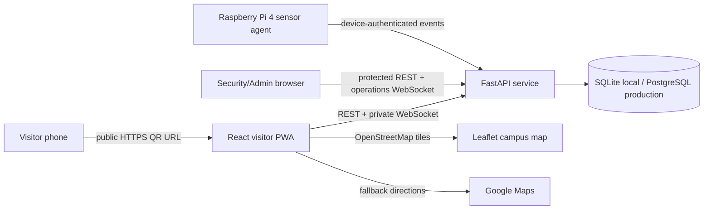

# SmartPark architecture

## System boundary

## Source of truth

The API owns current parking state. The React demo state is used only when `VITE_API_URL` is not configured. In API mode, the visitor fetches authoritative state after session creation, WebSocket messages, and reconnects.

Parking states are represented in the UI as:

| Backend state | Driver display | Meaning |
|---|---|---|
| `AVAILABLE` | Neutral gray/white | Bay can be allocated |
| `RESERVED` | Green assignment | Reserved for the current visitor when private |
| `OCCUPIED` | Solid red | Occupancy was confirmed |
| `OUT_OF_SERVICE` | Warning/neutral | Reserved for future sensor/config support |

Allocation is lowest-numbered available bay first. SQLite uses a process lock for the single-process prototype. PostgreSQL production should use row-level transactions and a distributed event bus for multiple workers.

## Privacy boundaries

Visitor tokens are opaque and stored only as hashes in the backend. Each entrance QR contains a signed checkpoint identifier, not visitor identity. A separate six-digit arrival code is hashed at rest and shown only to the visitor at session creation; security must verify it before allocation. A visitor receives their own assignment through `/visitor/me`, `/visitor/assignment`, and the visitor WebSocket. Security and administrators receive the aggregate operational lot state.

The entrance sensor is an approach signal. It cannot identify a visitor or determine which bay is occupied. Security matching or per-bay sensors are required before changing a reservation to occupied.

## Frontend surfaces

- Visitor welcome: facility name/logo, live space states, public pricing, entrance checkpoint session, opt-in PWA install prompt.
- GPS card: Leaflet/OpenStreetMap, opt-in foreground geolocation, OSRM-compatible routed path with distance/ETA, and Google Maps fallback. Smart Park does not store visitor coordinates; the opted-in routing provider receives the current and destination coordinates.
- Parking schematic: one access road on the left and L1-L4 vertically on the right.
- Assignment state: only the visitor's bay pulses green after an attendant verifies the arrival code; confirmed occupancy changes it to red.
- Separate `/admin` email/password login route. Staff API and operations WebSocket enforce role permissions; visitor navigation contains no administrator menu.
- Security dashboard: live lot, code verification for arrivals, checkpoint QR print, activity feed, sensor simulator controls.
- User management: protected account creation and roster.

## Runtime modes

### Demo mode

No `VITE_API_URL`. State is held in React and resets with a full page reload. This mode is useful for UI demonstrations only.

### API mode

Set `VITE_API_URL`. Visitor sessions, destinations, assignments, account access, and private events are provided by FastAPI. The frontend does not fabricate assignments after a successful backend response.

### Hardware mode

Run the IoT agent with a device token. It sends idempotent events with a unique event id. The backend ignores duplicates and broadcasts accepted state changes to authorized subscribers.
